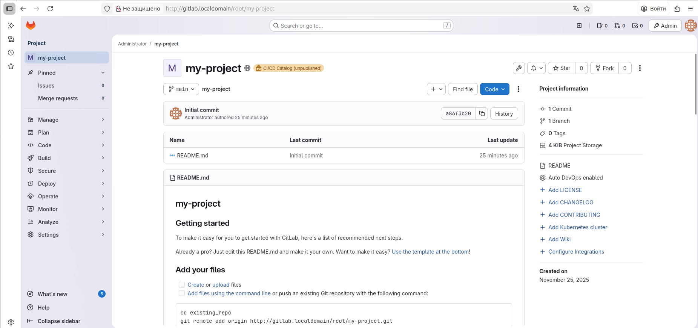
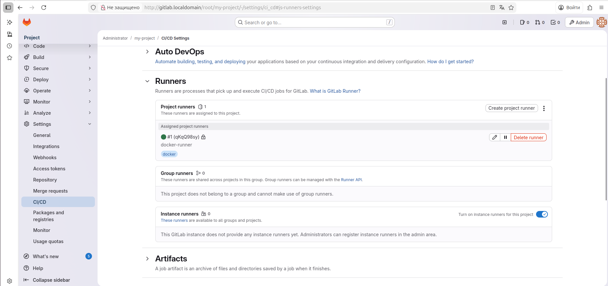
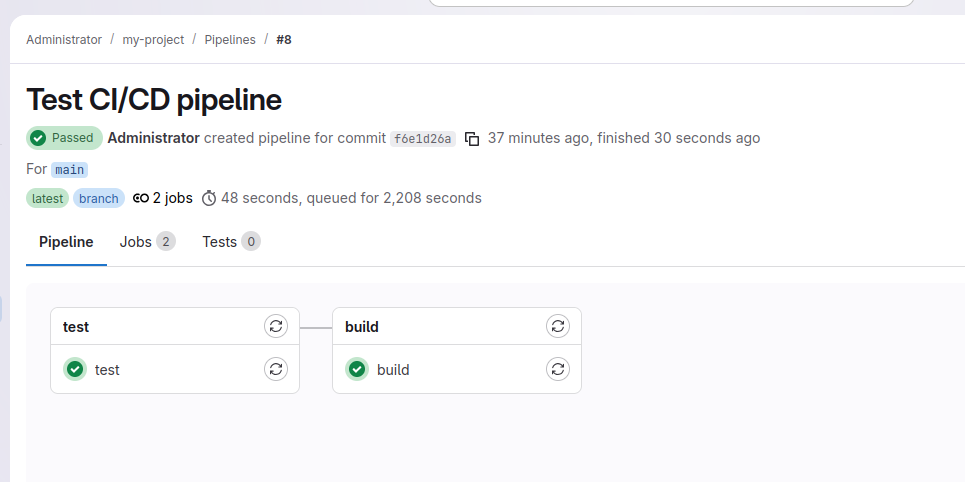
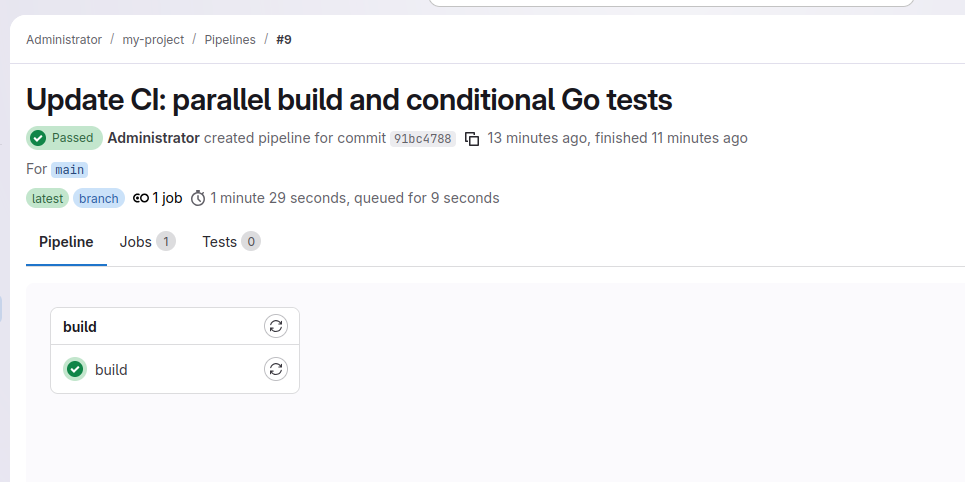

# Домашнее задание к занятию "`GitLab`" - `Гаврилова Валерия`

### Задание 1




---

### Задание 2

```
stages:
  - test
  - build

test:
  stage: test
  image: alpine:latest
  script:
    - echo "Running simple tests..."
    - echo "All tests passed!"
  tags:
    - docker

build:
  stage: build
  image: alpine:latest
  script:
    - echo "Building application..."
    - echo "Build completed successfully!"
  tags:
    - docker
```





---

### Задание 3

```
stages:
  - build
  - test

build:
  stage: build
  image: alpine:latest
  script:
    - echo "Building application immediately..."
    - echo "Build completed successfully!"
  tags:
    - docker

test:
  stage: test
  image: alpine:latest
  script:
    - echo "Running tests for Go files..."
    - echo "If any *.go files changed, tests would run here"
  tags:
    - docker
  rules:
    - if: '$CI_COMMIT_BRANCH == "main"'
      changes:
        - "*.go"
      when: on_success
    - when: never
```




